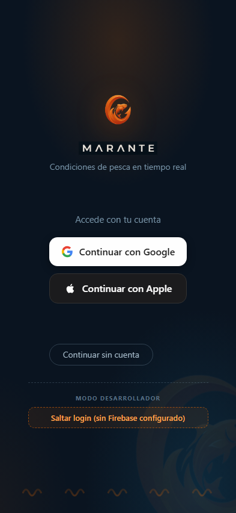
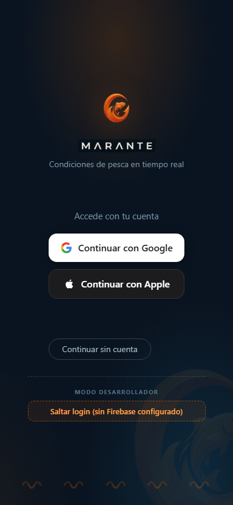
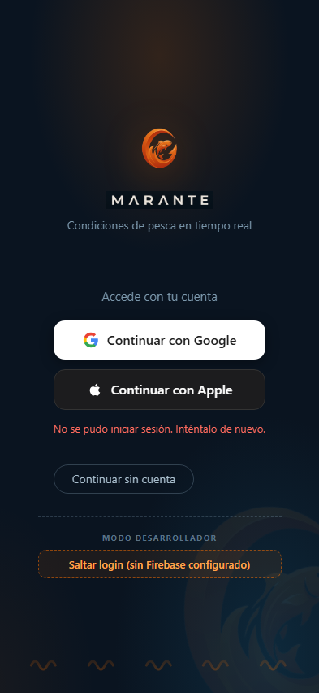
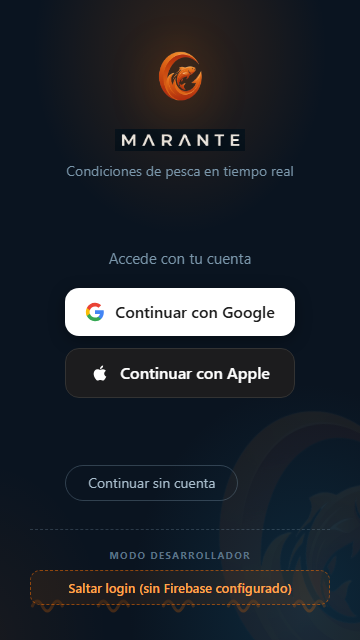

# Login / Onboarding

**Fecha:** 2026-09-25
**Rama auditada:** `feature/cuaderno-fotos-multiples`
**Commit:** `7ce04d8`
**Archivo fuente:** `src/ui/views/vista-login.js`

## Capturas

Viewport móvil estándar 393×852:

| Estado | Captura |
|---|---|
| Inicial |  |
| Detalle franja MODO DESARROLLADOR |  |
| Tras click en Google (durante) |  |
| Tras click en Google (estado final, con error) |  |
| Tras click en Apple (durante) |  |
| Tras click en Apple (estado final, con error) |  |

Viewport pequeño 360×640:

| Estado | Captura |
|---|---|
| Layout completo |  |

## Acciones probadas

| Acción | Resultado | Notas |
|---|---|---|
| Carga inicial de la pantalla | OK | Logo, wordmark, subtítulo, botones y olas de fondo renderizan correctamente. Sin errores de red para assets. |
| Click en `#pp-btn-google` | BUG (esperado sin Firebase real, pero revela un bug de fondo) | Falla en <1s con "No se pudo iniciar sesión. Inténtalo de nuevo." El spinner (`#pp-spinner`) nunca llega a ser visible en las capturas porque el fallo es casi instantáneo — no hay feedback de "procesando" perceptible. Consola muestra **violación de CSP**: `script-src 'self'` bloquea la carga de `https://apis.google.com/js/api.js`. |
| Click en `#pp-btn-apple` | BUG (esperado, Apple Sign In requiere iOS/config nativa) | Mismo mensaje de error genérico, mismo comportamiento de spinner casi invisible. Sin errores de consola adicionales distintos de los ya emitidos por el intento de Google. |
| Botón `#pp-btn-omitir` ("Continuar sin cuenta") | No ejecutado (para no destruir la vista y poder seguir capturando) | Posición y tamaño verificados por bounding box; ver hallazgos de jerarquía visual más abajo. |
| Detección de `#pp-btn-dev-skip` (modo DEV) | OK — presente | `import.meta.env.DEV` está activo en `npm run dev`, por lo que la franja "MODO DESARROLLADOR" se muestra tal como describe el comentario en `vista-login.js:5-9`. |
| Viewport reducido 360×640 | OK | Sin overflow horizontal ni vertical (`scrollWidth === clientWidth`, `scrollHeight === clientHeight`). Todo el contenido cabe sin cortes, incluida la franja dev. |

## Bugs y fallas encontradas

### CRITICAL

- **CSP bloquea el script de Google Identity incluso con credenciales reales.**
  `index.html:18` define `script-src 'self'`, sin excepción para `https://apis.google.com`. El flujo web de `@capacitor-firebase/authentication` para `signInWithGoogle()` intenta cargar `apis.google.com/js/api.js` y el navegador lo bloquea (confirmado en consola: *"Loading the script … violates … script-src 'self'"*). Esto significa que **aunque se configure un proyecto Firebase real** (`src/domain/firebase-config.js:14-21` con placeholders `TU_API_KEY` etc.), el login con Google seguirá fallando en cualquier contexto web (navegador de escritorio para pruebas, o un eventual WebView/PWA). No afecta necesariamente al flujo nativo Android (que usa Google Sign-In nativo vía el plugin de Capacitor, no gapi), pero sí bloquea completamente las pruebas y cualquier fallback web. Archivo: `index.html:16-24`.

### HIGH

- **Feedback de carga casi imperceptible en el fallo de login.** `setCargando(true)` activa el spinner (`vista-login.js:226-229`), pero como el error llega en menos de un segundo (rechazo rápido de la promesa), el spinner apenas alcanza a pintarse un frame antes de ocultarse de nuevo. El usuario percibe el botón como "no respondió" seguido de un mensaje de error, no como "se procesó una solicitud". Archivo: `vista-login.js:231-246`.
- **El mensaje de error no ofrece una salida.** `errorEl.textContent = 'No se pudo iniciar sesión. Inténtalo de nuevo.'` (`vista-login.js:241`) es genérico y no distingue causas (sin red, sin configurar, credenciales rechazadas), ni redirige al usuario hacia "Continuar sin cuenta", que es una ruta de producto igual de válida (ver README: uso anónimo es una decisión de producto deliberada, no un fallback de segunda). Con Google y Apple fallando al 100% en el estado actual del proyecto, este es el único mensaje que absolutamente todos los usuarios de prueba verán.

### MEDIUM

- **Layout shift al aparecer el error (~18px).** El párrafo `#pp-login__error` tiene `min-height: 18px` (`vista-login.js:99` en el bloque CSS) pero el texto real ocupa más que ese mínimo, empujando el botón "Continuar sin cuenta" hacia abajo cuando aparece el error (confirmado comparando bounding box antes/después: el botón se desplaza de aprox. y=570 a y=588). Pequeño pero perceptible re-layout justo cuando el usuario probablemente ya tiene el dedo cerca de esa zona.
- **Jerarquía tipográfica débil entre el tagline de marca y la instrucción de login.** `.pp-login__sub` (14px, `#7a96aa`) y `.pp-login__titulo` (15px, mismo color `#7a96aa`) son casi indistinguibles en peso visual (`vista-login.js:61-68`), pese a cumplir roles semánticos distintos: uno es la propuesta de valor de marca, el otro es una instrucción de acción. El contraste contra el fondo (~5.97:1 sobre `#0a1420`) es correcto para WCAG AA, así que no es un problema de accesibilidad — es un problema de agrupación (Gestalt) que hace que el bloque de marca y el bloque de acciones no se lean como una sola composición.
- **La franja "MODO DESARROLLADOR" rompe el lenguaje visual del resto de la pantalla.** Usa bordes discontinuos y un naranja de alerta (`vista-login.js:111-126`) que no comparte ni radio, ni relleno, ni tratamiento de sombra con el resto de botones (`.pp-login__btn`, `.pp-login__omitir`). Es intencional como señal de "esto es debug", pero si esta build (con `DEV` activo) llega a capturarse en un screenshot para stakeholders, tienda de apps o testers, se lee como "parche olvidado" más que como una feature de desarrollo cuidada.

### LOW

- **Botón "Continuar sin cuenta" visualmente subordinado.** Es un outline sin relleno, el más pequeño de los tres CTAs (`vista-login.js:89-95`), y queda además empujado hacia abajo por el mensaje de error. Dado que el producto trata el uso anónimo como una ruta de primera clase (no un fallback), la jerarquía visual actual comunica lo contrario.
- **Icono + texto centrados como bloque único en los botones sociales, no alineados a la convención oficial de "Sign in with Google" (icono fijo al borde izquierdo).** No es un error funcional, solo una desviación menor de la guía de marca de Google (`vista-login.js:69-88`, `.pp-login__btn` usa `justify-content: center` con `gap: 10px` para icono+texto como grupo).

## Análisis PFD

Resumen condensado del análisis con `perception-first-design:all` (cinco capas: Foundation, L1 Primera impresión, L2 Fluidez de procesamiento, L3 Sesgos de percepción, L4 Arquitectura de decisión).

### Analyze (descriptivo — qué pasa realmente)

- **Foundation:** pocos elementos interactivos (bien), pero el hueco vertical grande entre el bloque de marca y "Accede con tu cuenta" rompe la agrupación por proximidad (Wertheimer 1923): el cerebro procesa marca y acciones como dos bloques no relacionados en vez de una sola composición. *Efecto:* coste de parseo extra en la primera visita, invisible en visitas repetidas.
- **L1 (primera impresión):** el gate de 50ms (Lindgaard 2006) se resuelve con "app oscura competente y genérica", no con "app de pesca/costa" — el único material realmente temático (fila de olas) está al 0.5 de opacidad y comprimido al fondo. El halo de calidad (Kurosu & Kashimura 1995) no se transfiere a un recuerdo de marca específico.
- **L2 (fluidez):** el sistema de producción (botones, radios, sombras) es coherente entre sí, pero la franja MODO DESARROLLADOR es un idioma visual distinto dentro de la misma vista capturada — una violación de coherencia real, aunque acotada a builds de desarrollo.
- **L3 (sesgos):** los botones Google/Apple maximizan la adherencia a convención (cero error de predicción, Clark 2013) — elección correcta para reducir fricción de reconocimiento — pero el copy de error no se alinea con la propuesta del producto (uso anónimo válido), perdiendo la oportunidad de redirigir en el momento de mayor fricción real.
- **L4 (decisión):** las tres rutas están presentes y con etiquetas específicas y honestas (sin dark patterns), pero el peso visual favorece fuertemente Google > Apple > sin cuenta, exactamente al revés de lo que hoy es la ruta que **realmente funciona** para el 100% de los testers.
- **Compuesto cruzado relevante:** el halo de marca generado en L1 no llega a la zona de decisión (los botones), así que el momento de mayor atención del usuario contiene la menor cantidad de señal de marca — una desconexión entre dónde se invierte la personalidad visual y dónde ocurre la decisión.

### Solve (prescriptivo — qué se derivó como requisito)

Requisitos derivados capa por capa (R1-R5), no negociables:
- **R1 (Foundation):** fusionar tagline y "Accede con tu cuenta" en una jerarquía de dos niveles clara, reduciendo el hueco muerto central para que la pantalla se lea como una sola composición.
- **R2 (L1):** aumentar la proporción de señal específica de marca (costa/pesca) dentro del área de primer scan, no solo en el borde inferior.
- **R3 (L2):** el bloque dev debe compartir el sistema de botones de producción (mismo radio/sombra), diferenciado solo por acento de color, no por un lenguaje visual completo distinto.
- **R4 (L3):** el estado de error debe redirigir explícitamente hacia "Continuar sin cuenta" como salida legítima, no solo disculparse.
- **R5 (L4):** dar paridad visual real a "Continuar sin cuenta" frente a los botones sociales, acorde a que el producto lo trata como ruta de primera clase.

La solución que satisface las cinco a la vez implica tocar composición/spacing, refuerzo de motivo visual de marca, restyle del bloque dev, copy+layout del estado de error, y jerarquía del botón "sin cuenta" — ninguno de estos cambios es solo cosmético aislado; se refuerzan entre sí (p. ej., R4 y R5 comparten la misma zona de la pantalla).

### Evaluate (puntuado — cómo rinde el artefacto actual)

| Capa | Puntuación | Lectura |
|---|---|---|
| Foundation | 78/100 | Buena — pocos elementos, responsive verificado, un solo sistema tipográfico; penaliza el hueco muerto y la ambigüedad de agrupación. |
| L1 Primera impresión | 62/100 | Mediocre-buena — sin assets rotos ni placeholder, hero claro; penaliza la baja densidad de señal de marca específica de pesca/costa. |
| L2 Fluidez de procesamiento | 58/100 | Mediocre — sistema de producción coherente, pero el bloque dev es una violación mayor de lenguaje visual visible en el estado capturado. |
| L3 Sesgos de percepción | 66/100 | Aceptable — convención bien aprovechada en los botones sociales; penaliza el copy de error que no refuerza la propuesta real del producto. |
| L4 Arquitectura de decisión | 71/100 | Buena — etiquetas específicas, sin dark patterns; penaliza el desajuste entre peso visual y la ruta que realmente es viable hoy. |

**Media:** 67/100 — "intención parcialmente lograda": los fundamentos (bajo ruido, sin patrones oscuros, convención bien usada) son sólidos, pero la distintividad de marca en el momento de decisión y la coherencia del bloque dev son los mayores lastres.

## Plan de mejora priorizado

### Quick win (bajo esfuerzo, alto impacto)

1. **Redirigir el error de login hacia "Continuar sin cuenta".** Cambiar el texto de `errorEl` en `vista-login.js:241` para incluir una invitación explícita, p. ej. *"No se pudo iniciar sesión. Puedes continuar sin cuenta mientras tanto."* — o, mejor, mantener el mensaje corto y añadir un enlace/subrayado dentro del mismo `#pp-error` que dispare el mismo handler que `#pp-btn-omitir` (`vista-login.js:250`).
2. **Reservar altura fija para el error y evitar el layout shift.** Ajustar `.pp-login__error` (bloque CSS en `vista-login.js`, selector `.pp-login__error`) para que `min-height` cubra realmente el alto de una línea de texto a 13px con el `line-height` real usado, evitando el salto de ~18px del botón "Continuar sin cuenta".
3. **Restyle del bloque MODO DESARROLLADOR para compartir el sistema visual de producción.** En `.pp-login__dev-btn` (`vista-login.js:120-126`) cambiar borde discontinuo por el mismo `border-radius`/sombra que `.pp-login__omitir`, manteniendo el acento naranja solo como color de fondo/texto, no como tratamiento de borde distinto.

### Medio (requiere algo de diseño/decisión de producto)

4. **Dar paridad visual a "Continuar sin cuenta".** Revisar `.pp-login__omitir` (`vista-login.js:89-95`) para acercar su tamaño/prominencia a los botones sociales — por ejemplo mismo ancho máximo y padding que `.pp-login__btn`, conservando el estilo outline para diferenciarlo semánticamente sin subordinarlo en tamaño.
5. **Reforzar la jerarquía entre tagline de marca e instrucción de login.** Diferenciar `.pp-login__sub` y `.pp-login__titulo` (`vista-login.js:61-68`) en peso, tamaño o color, y reducir/rellenar el hueco de ~90px entre el bloque de marca y "Accede con tu cuenta" (posiblemente con el motivo de olas u otro elemento gráfico, no solo espacio vacío).
6. **Investigar y resolver la violación de CSP para Google Sign-In web.** Decidir si el flujo web de `signInWithGoogle()` es necesario (pruebas en navegador, posible PWA) y, de serlo, añadir la excepción mínima necesaria a `script-src` en `index.html:16-24` (idealmente con un dominio explícito y no `unsafe-inline`), documentando por qué se abre esa excepción igual que ya se documenta el resto de la CSP en el comentario de `index.html:7-15`.

### Grande (requiere trabajo de diseño visual + posiblemente ilustración)

7. **Reforzar el motivo visual de costa/pesca más allá del logo y la fila de olas.** Explorar una textura o ilustración sutil de agua/costa detrás del stack de botones (no solo en los bordes), de forma que la señal de marca llegue hasta la zona de decisión y no se quede solo en el bloque superior. Candidato de trabajo conjunto con quien mantiene los SVG de especies/assets (ver convención de `img/svg/` en `CLAUDE.md`).
8. **Configurar un proyecto Firebase real y validar el flujo completo de Google/Apple en Android nativo** (fuera del alcance de esta auditoría visual, pero es el bloqueante real para que cualquier mejora de UX del estado de error dejе de ser necesaria en el camino feliz).

## Preguntas abiertas

- ¿Es un objetivo del producto que el login funcione también en navegador de escritorio (web/PWA), o el único target real es el WebView de Android vía Capacitor con Google Sign-In nativo? Esto determina si la violación de CSP (`script-src 'self'` bloqueando `apis.google.com`) es CRITICAL de verdad o solo afecta a un entorno de prueba secundario.
- ¿Hay ya un proyecto Firebase real planeado, o el login social queda pospuesto indefinidamente en favor del uso anónimo como camino principal? Si es lo segundo, quizás tiene más sentido rediseñar la pantalla priorizando visualmente "Continuar sin cuenta" desde ya, en vez de tratarlo como fallback secundario.
- ¿Existe riesgo real de que una build con `import.meta.env.DEV` activo (y por tanto la franja MODO DESARROLLADOR visible) se use para capturas de store listing, demos a stakeholders o testing con usuarios externos? Si no, el hallazgo MEDIUM sobre el bloque dev baja de prioridad.
- ¿Hay lineamientos de marca ya definidos para "Marante" (paleta, motivo gráfico oficial de olas/costa) más allá de lo visto en `www/css/app.css` / `src/styles/`, que deban reutilizarse aquí en vez de proponer nuevos elementos gráficos desde cero?
